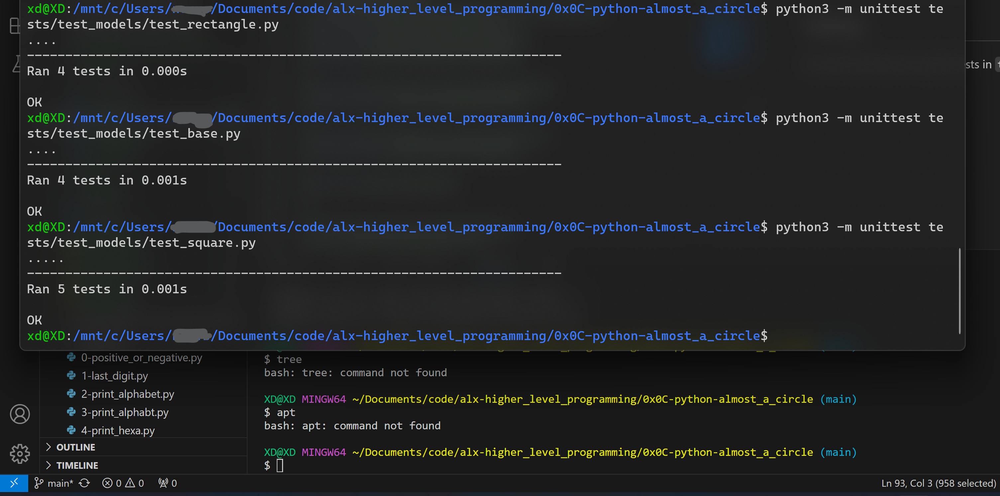
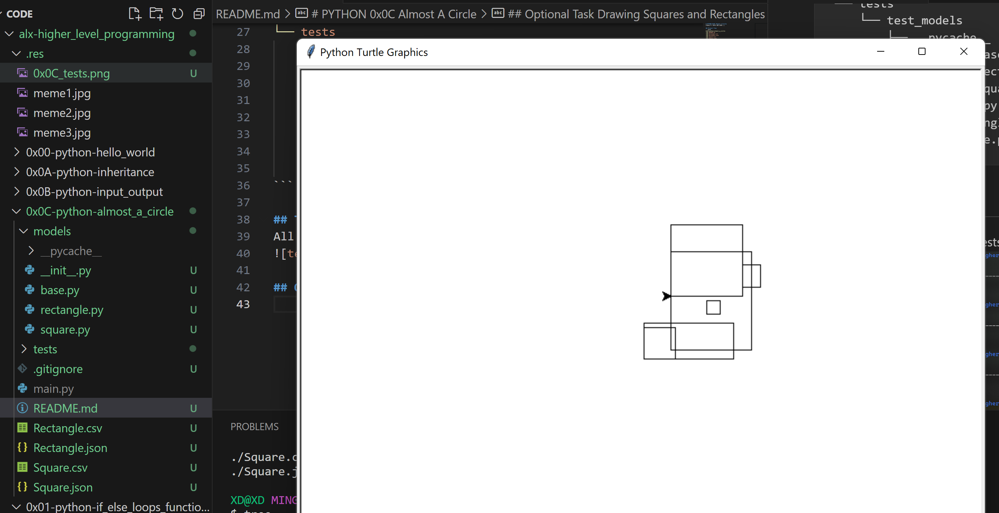
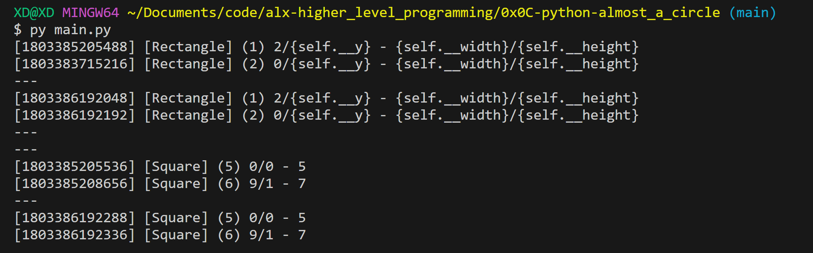
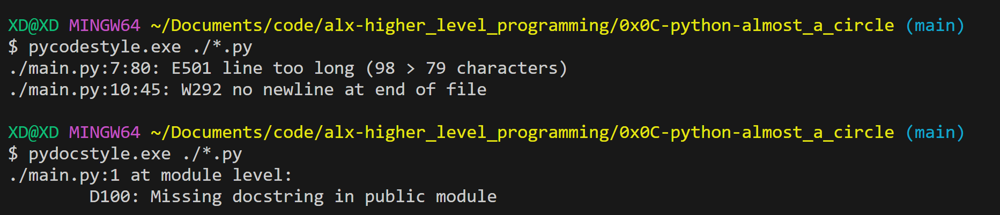
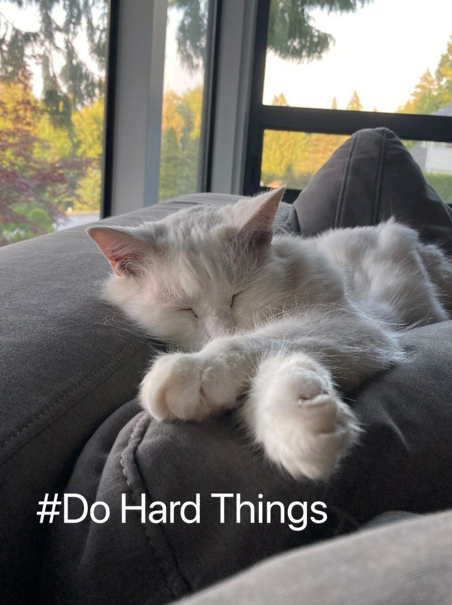

# PYTHON 0x0C Almost A Circle
Hi, FINALLY C DAYS ARE OVER :] 

## Project Tree
```bash
0x0C-python-almost_a_circle
├── README.md
├── Rectangle.csv
├── Rectangle.json
├── Square.csv
├── Square.json
├── main.py
├── models
│   ├── __init__.py
│   ├── __pycache__
│   │   ├── __init__.cpython-310.pyc
│   │   ├── __init__.cpython-312.pyc
│   │   ├── base.cpython-310.pyc
│   │   ├── base.cpython-312.pyc
│   │   ├── rectangle.cpython-310.pyc
│   │   ├── rectangle.cpython-312.pyc
│   │   ├── square.cpython-310.pyc
│   │   └── square.cpython-312.pyc
│   ├── base.py
│   ├── rectangle.py
│   └── square.py
└── tests
    └── test_models
        ├── __pycache__
        │   ├── test_base.cpython-310.pyc
        │   ├── test_rectangle.cpython-310.pyc
        │   └── test_square.cpython-310.pyc
        ├── test_base.py
        ├── test_rectangle.py
        └── test_square.py
```

## Testing
All module files have specific tests in `tests/` folder


## Optional Task Drawing Squares and Rectangles


## All Tasks Were Tested Using attached main.py file


## All Modules are following Documenting and python stylting rules
(Except main.py copied from task example)


## Thanks for reviewing
Here's a kitty to make your day!
